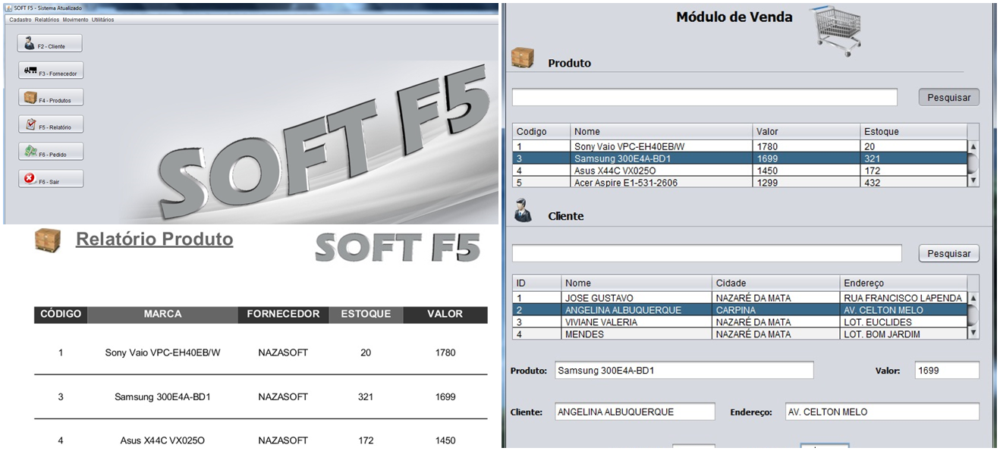

## Escola Técnica - Projeto Integrador II - Java SE

###  :computer: Tela

  

----------

### :hammer_and_wrench: Ferramentas
As seguintes tecnologias foram utilizadas na construção do projeto:
- NetBeans;
- iReport;
- Java Swing;
- JDBC (Java Database Connectivity);
- Banco de Dados MySQL.

----------

###  :gear: Funções
- [x] PDV (Ponto de Venda);
- [x] CRUD de Clientes;
- [x] CRUD de Fornecedores;
- [x] CRUD de Produtos;
- [x] Geração de Relatórios.

----------

###  :eyeglasses: Autor
José Gustavo da Silva.
[
**Linkedin**
](https://www.linkedin.com/in/jose-gustavo312/)